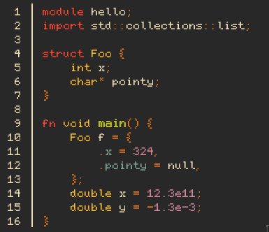

# Print3

A `cat`-like programming built for C3 source files, it will try to highlight
the source like inside an editor.

Example:



A special thank you to [@ManuLinares](https://github.com/ManuLinares/) for the regex
that selects any valid C3 number
(including the fun stuff like `1.3e-39` or `32ull`)!


## Usage:

```
./print3 [options...] file(s)

Print C3 files with colours. A bit akin to 'cat' or 'bat'.

Options and files can generally be mixed, only when an option requires
an argument, it is expected to follow directly behind.

Available options:
-h, --help              Show this help message

--tabsize <number>      Amount of spaces to print for a tab character
-n, --number            Show line numbers
--nonumber              Show no line numbers
--nrformat <text>       Format for numbers (f.e. "%d | ").
--line-start <number>   Start printing from this line (inclusive)
--line-stop <number>    Stop printing at this line (inclusive)
--print-buffer-size <number>
                      Set the size of the print buffer (bytes, default 128)

--colour-<thing> <text> Set the colour for <thing> to <text>, should be
                      specified in "#RRGGBB" format. Available things:
                      at, call, comment, comptime_ident, constant, ident,
                      keyword, member, number, string, symbol, type.

Allowed format for --nrformat:
<pre>%[-][0._][1-9]d<post>

- <pre> and <post> are static strings printed around the line numbe
- Starts with '%' and ends with 'd'
- Optionally '-' to set alignment to left (default right)
- Optionally '0', '.' or '_' to use as padding character
- Optionally 1-9 as minimum width specifier (default 3)

Examples: "%d", "line - %-5d :"
```


## Improvement points:
- add json config file for easier default overrides
- add either builtin pager, or auto-pipe to `less` or `more` from within `print3`


## Fun IO optimization

I spent some time looking at optimizing `print3` , and `perf` showed me that
C3's `printf` machine took quite some time.
I decided to try and replace all `printf` occurences with multiple `print` calls
and see if that speeded up things:

```c3
io::printf(
    "%s%s%s",
    Ansi.BRIGHT_GREEN,
    word,
    Ansi.RESET
);
// became
io::print(Ansi.BRIGHT_GREEN);
io::print(word);
io::print(Ansi.RESET);
```

This sped up things by almost **2.5x**.

Some slight tweaking to this by caching `stdout` and creating my own
`BufferedOutput` abstraction, `hyperfine` showed some fun results:

```
Benchmark 1: ./build/old_print3 long.c3
  Time (mean ± σ):     178.5 ms ±   1.7 ms    [User: 167.0 ms, System: 10.7 ms]
  Range (min … max):   175.9 ms … 184.3 ms    100 runs

Benchmark 2: ./build/print3 long.c3
  Time (mean ± σ):      47.1 ms ±   0.6 ms    [User: 35.8 ms, System: 11.1 ms]
  Range (min … max):    45.7 ms …  48.5 ms    100 runs

Summary
  ./build/print3 long.c3 ran
    3.79 ± 0.06 times faster than ./build/old_print3 long.c3
```

In short: when the main goal of your application is printing a file to the
terminal, spend some time optimising that printing part. The standard library
is made for ergonomics, not for raw speed in specialised usecases.
